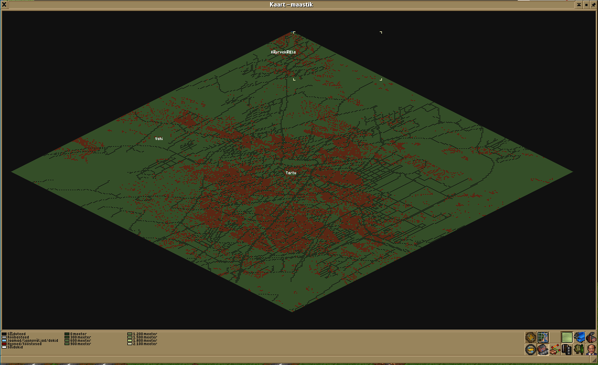

# OpenStreetMap to Transport Tycoon Deluxe (TTD) scenario converter

NOTE: this is not finished and doesn't work properly yet

## Usage

Download a osm.pbf file from https://download.geofabrik.de/ and run a command like

```
go run osm2ttd.go [flags] INFILE OUTFILE LONGITUDE LATITUDE
```

Available flags:
- size: Size of the map in degrees
- roads: OpenStreetMaps tags to count as roads
- towns: OpenStreetMaps tags to count as towns

Example:

```
go run osm2ttd.go --size=0.1 in.osm.pbf out.sv0 58.38 26.7225
```

This produces



## TTD savegame library for Go

The subdirectory ttd/ contains a library for saving and loading TTD savegames in golang. It is independent of the converter and should be suitable for use in other projects. It is not finished yet, so the API will change.

It mostly uses http://marcin.ttdpatch.net/sv1codec/TTD-locations.html and https://wiki.openttd.org/en/Manual/Interoperability as references.

Usage:

```go
s := ttd.Savegame{
	Title: "Example",
	Towns: []ttd.Town{
		ttd.Town{X: 128, Y: 128, Name: "Town"},
	},
    ...
}
f, err := os.Create("example.sv0")
if err != nil {
	panic(err)
}
err = s.Save(f)
if err != nil {
	panic(err)
}
```

```go
f, err := os.Open("example.sv0")
if err != nil {
	panic(err)
}
s, err := ttd.Load(f)
if err != nil {
	panic(err)
}
```

See `ttd/types.go` for the definitions of the fields.
